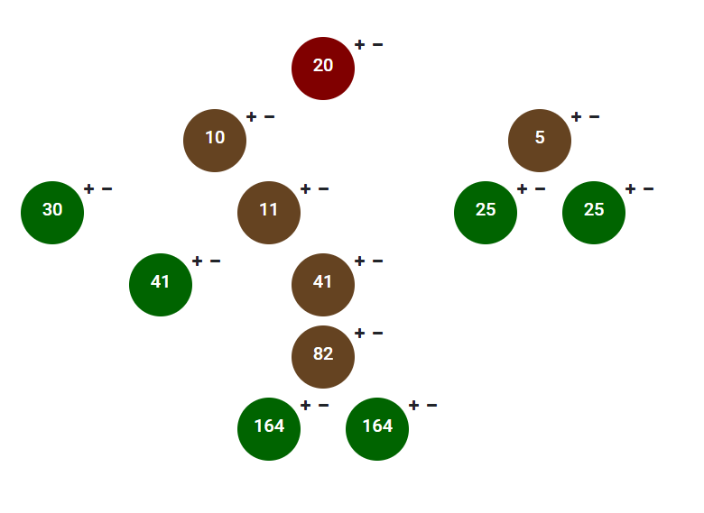
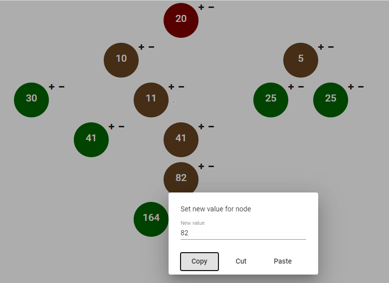

# Tree management app
It is application to tree structure management. It allows for any modification of the tree structure e.g. add, remove and other. 
State of the tree is saved in the database. In leaves of the tree are sum of all values to root node.
Additionally, app allows to copy or cut a fragment of tree structure and paste it to any place.

## Run:
1.Use Docker Compose (Recommended)
* Requires installation:
  - Docker
  - Docker-compose
* Open shell, go to main project folder and run command:
```file:///home/piotr/projects/Tree-management-app/Example.PNG?stamp=0
docker-compose up
```

2.Manual <br />

[**Backend**] <br /> 
* Requires:
  - Maven
  - Java
  - Running database
* Open shell, go to main project folder and run commands:
```
mvn package
java -jar ./target/Tree-management-app-0.0.1-SNAPSHOT.jar
```

[**Frontend**] <br /> 
* Requires:
  - npm
  - Angular
* Open shell, go to main project folder and run commands:
```
cd ./frontend/tree-management-web
npm install --save-dev @angular-devkit/build-angular (if need)
ng serve
```
[**Database**] <br /> 
* Application need to install database HSQL manually. 
e.g. 
```
docker run -d --name hsqldb \
    -e "HSQLDB_DATABASE_NAME=hsqldb" \
    -e "HSQLDB_DATABASE_ALIAS=b4mdb" \
    -e "HSQLDB_USER=sa" \
    -e "HSQLDB_PASSWORD=" \
    -p 9001:9001 \
    blacklabelops/hsqldb
```

##### Ports
* Frontend: 4200
* Backend: 8080
* Database: 9001

## Technologies and libraries:
* Java 8
* Spring boot
* Spring Data
* JPA/Hibernate
* HSQL
* Maven
* Swagger
* Lombok
* Angular 9
* Docker, docker-Compose
* Junit 

## Screens:




##### Colors:
* Red - Root node
* Brown - Node
* Green - Leaf node

## Use cases:
* After open a page, a root tree node is automatically created.
* Next to a given node, there are 2 buttons that allow you to add a child to the current node and remove the selected node with all children.
* After clicking on a given node, a dialog is displayed that allows you to edit values ​​and copy, cut and paste fragments of the structure.
* When you change value in leaf node, program automatically should create new leaf (with the calculated sum of values to the root node) and add it to modified node as its child. 
* When you change value in node (No leaf node), program should automatically update leaf node value.
* When you remove root tree node, program automatically init new root tree node.
* When you remove any node and all its children, program should automatically update value for new leaf node in structure.

##### Swagger:
http://localhost:8080/api/swagger-ui.html

